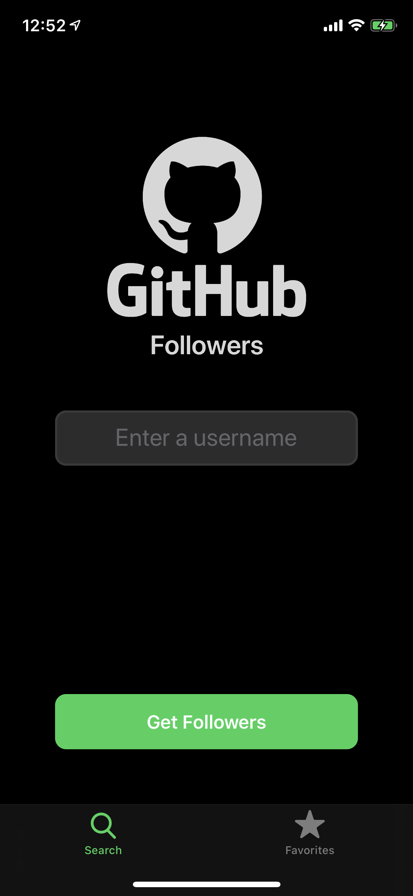
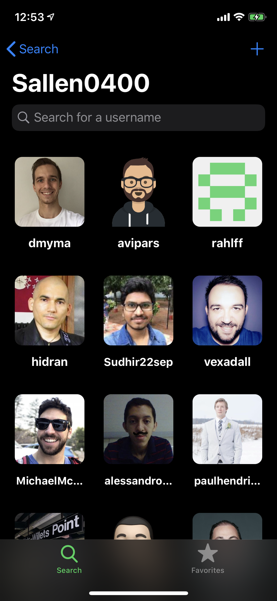
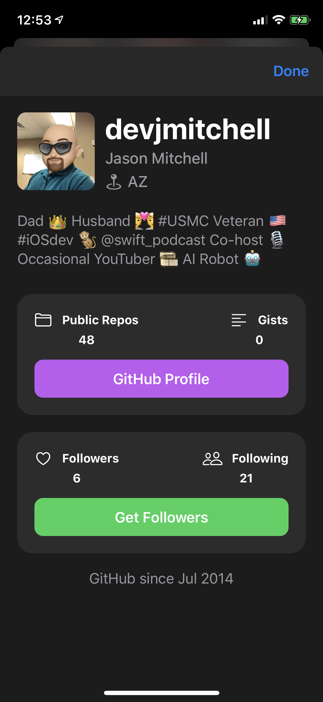
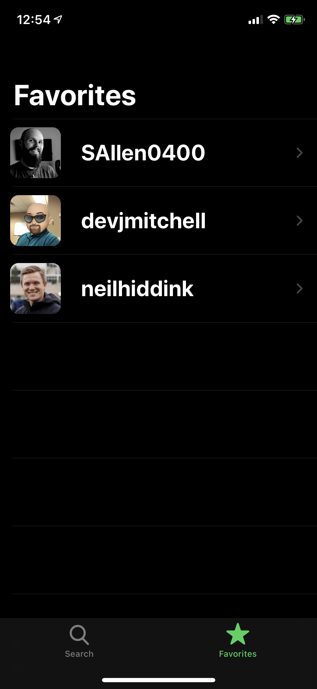

# GitHubFollowers
Sean Allen's iOS Dev Job Interview Practice - Take Home Project

Sean Allen is a well known Swift developer and has created an online course to help get iOS developers into the workforce. I completed this course in April 2020.  This is a description of the project itself, it’s requirements and the valuable knowledge I learned throughout the course.

## Project Brief:
* The user can enter a GitHub username and retrieve a list of that username’s followers
* The user can search within these followers for a specific follower
* The user is able to tap on a follower from that list to get more information about that follower
* The user is able to save favorite username searches so they don’t have to type them every time. This needs to persist between app launches

## Requirements:
* 100% programmatic UI 
* No 3rd party libraries

## Skills covered & learned:
* Programmatic UI
* The value and flexibility of custom UI components
* The value of custom superclass view controllers
* The balance needed between Strict MVC principles vs logical code layout
* The importance of code readability/understandability to another developer
* Techniques for avoiding Massive View Controller - “Does the view controller need to know this?”
* Delegates and Protocols
* UICollectionView and Diffable Data Source
* Caching Images
* REST and JSON networking
* Result Data Type
* Use cases and pros/cons of Singletons
* Codable
* Persisting data in User Defaults
* TableView with custom cells
* ARC and memory leaks
* UISearchControllers
* Adapting the UI for all screen sizes (including iPhone SE)
* Supporting Dark Mode

### Technology: 
* Xcode 11.4
* iOS 13+

## Screenshots

The Search screen where the user can enter a GitHub username

The List of Followers for that GitHub user

A GitHub users Profile Screen

The list of GitHub users you have decided to favorite

